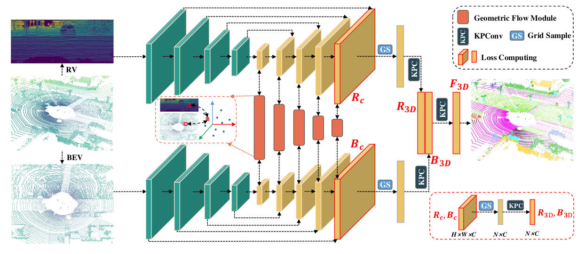
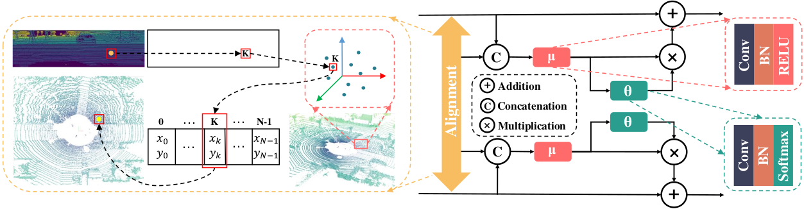

# GFNet [](https://arxiv.org/abs/2207.02605) [](https://openreview.net/forum?id=LSAAlS7Yts) [](https://haibo-qiu.github.io/GFNet/)
This is the Pytorch implementation of our following paper:
>**[GFNet: Geometric Flow Network for 3D Point Cloud Semantic Segmentation](https://arxiv.org/abs/2207.02605)**
><br>*Accepted by [TMLR](https://openreview.net/forum?id=LSAAlS7Yts), 2022*
><br>*Haibo Qiu, Baosheng Yu and Dacheng Tao*<br>
><details><summary> <b>Abstract</b></summary>
>
>Point cloud semantic segmentation from projected views, such as range-view (RV) and bird's-eye-view (BEV), has been intensively investigated. Different views capture different information of point clouds and thus are complementary to each other. However, recent projection-based methods for point cloud semantic segmentation usually utilize a vanilla late fusion strategy for the predictions of different views, failing to explore the complementary information from a geometric perspective during the representation learning. In this paper, we introduce a geometric flow network (GFNet) to explore the geometric correspondence between different views in an align-before-fuse manner. Specifically, we devise a novel geometric flow module (GFM) to bidirectionally align and propagate the complementary information across different views according to geometric relationships under the end-to-end learning scheme. We perform extensive experiments on two widely used benchmark datasets, SemanticKITTI and nuScenes, to demonstrate the effectiveness of our GFNet for project-based point cloud semantic segmentation. Concretely, GFNet not only significantly boosts the performance of each individual view but also achieves state-of-the-art results over all existing projection-based models. 
></details>

<details><summary> <b>Segmentation GIF</b></summary>

<br>
(_A gif of segmentation results on [SemanticKITTI](http://semantic-kitti.org) by GFNet_)
</details>

<details><summary> <b>Framework</b></summary>



</details>

**Table of Contents**
* [Installation](#installation)
* [Data preparation](#data-preparation)
* [Training](#training)
* [Inference](#inference)
   * [SemanticKITTI](#semantickitti)
   * [nuScenes](#nuscenes)
* [Acknowledgment](#acknowledgment)
* [Citation](#citation)

## Installation
1. Clone this repo:
    ```bash
    git clone https://github.com/haibo-qiu/GFNet.git
    ```
2. Create a conda env with
   ```bash
   conda env create -f environment.yml
   ```
   Note that we also provide the `Dockerfile` for an alternative setup method.

## Data preparation

1. Download point clouds data from [SemanticKITTI](http://semantic-kitti.org) and [nuScenes](https://www.nuscenes.org/nuscenes#download).
2. For SemanticKITTI, directly unzip all data into `dataset/SemanticKITTI`.
3. For nuScenes, first unzip data to `dataset/nuScenes/full` and then use the following cmd to generate pkl files for both training and testing:
    ```bash
    python dataset/utils_nuscenes/preprocess_nuScenes.py
    ```
4. Final data folder structure will look like:
   ```
      dataset
      └── SemanticKITTI
          └── sequences
              ├── 00
              ├── ...
              └── 21
      └── nuScenes
          └── full
              ├── lidarseg
              ├── smaples
              ├── v1.0-{mini, test, trainval}
              └── ...
          └── nuscenes_train.pkl
          └── nuscenes_val.pkl
          └── nuscenes_trainval.pkl
          └── nuscenes_test.pkl

    ```

## Training
- Please refer to `configs/semantic-kitti.yaml` and `configs/nuscenes.yaml` for dataset specific properties.
- Download the [pretrained resnet model](https://drive.google.com/file/d/1I85xLRwUMIeW_7BvdZ4uZ0Lm4j3zxLT1/view?usp=sharing) to `pretrained/resnet34-333f7ec4.pth`.
- The hyperparams for training are included in `configs/resnet_semantickitti.yaml` and `configs/resnet_nuscenes.yaml`. After modifying corresponding settings to satisfy your purpose, the network can be trained in an end-to-end manner by:
    1. `./scripts/start.sh` on SemanticKITTI.
    2. `./scripts/start_nuscenes.sh` on nuScenes.

## Inference
### SemanticKITTI
1. Download [gfnet_63.0_semantickitti.pth.tar](https://drive.google.com/file/d/1J7jeSY5hGIHZO3WBdZnZLfdH-plv-81g/view?usp=sharing) into `pretrained/`.
2. Evaluate on SemanticKITTI valid set by:
    ```bash
    ./scripts/infer.sh
    ```
    Alternatively, you can use the [official semantic-kitti api](https://github.com/PRBonn/semantic-kitti-api#evaluation) for evaluation.
3. To reproduce the results we submitted to the test server:
    1. download [gfnet_submit_semantickitti.pth.tar](https://drive.google.com/file/d/1bdq2_l5Q0tyww7wc3wlyrU09H2tVY5LF/view?usp=sharing) into `pretrained/`, 
    2. uncomment and run the second cmd in `./scripts/infer.sh`.
    3. zip `path_to_results_folder/sequences` for submission.

### nuScenes 
1. Download [gfnet_76.8_nuscenes.pth.tar](https://drive.google.com/file/d/1r5SXpToLBdiYdNp7we9Bw-Chmc0x7QPd/view?usp=sharing) into `pretrained/`.
2. Evaluate on nuScenes valid set by:
    ```bash
    ./scripts/infer_nuscenes.sh
    ```
3. To reproduce the results we submitted to the test server:
    1. download [gfnet_submit_nuscenes.pth.tar](https://drive.google.com/file/d/16nI5NjZ4wgNRwEC_HjqrVQLFLWXqThzs/view?usp=sharing) into `pretrained/`.
    2. uncomment and run the second cmd in `./scripts/infer_nuscenes.sh`.
    3. check the valid format of predictions by:
        ```bash
        ./dataset/utils_nuscenes/check.sh
        ```
        where `result_path` needs to be modified correspondingly.
    4. submit the `dataset/nuScenes/preds.zip` to the test server.
    
## Acknowledgment

This repo is built based on [lidar-bonnetal](https://github.com/PRBonn/lidar-bonnetal), [PolarSeg](https://github.com/edwardzhou130/PolarSeg) and [kprnet](https://github.com/DeyvidKochanov-TomTom/kprnet). Thanks the contributors of these repos!

## Citation
If you use our code or results in your research, please consider citing with:
```bibtex
@article{qiu2022gfnet,
  title={{GFN}et: Geometric Flow Network for 3D Point Cloud Semantic Segmentation},
  author={Haibo Qiu and Baosheng Yu and Dacheng Tao},
  journal={Transactions on Machine Learning Research},
  year={2022},
  url={https://openreview.net/forum?id=LSAAlS7Yts},
}
```
